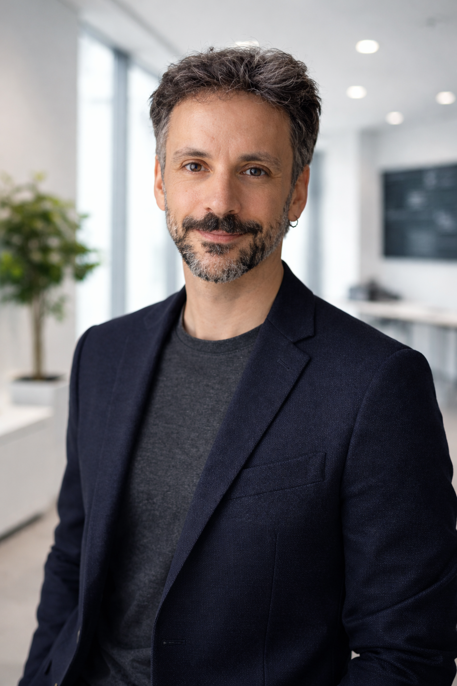

{width=200 .rounded-circle style="display: block; margin: 0 auto 1.5rem;"}

::: {.text-center .lead}
**Data Scientist · Biophysicist · Consultant**

I help pharma and biotech organisations turn complex data into actionable decisions,
combining scientific rigour with practical machine-learning engineering.
:::

::: {.text-center style="margin: 1.5rem 0 2rem;"}
[View Projects](projects/index.qmd){.btn .btn-primary}
[About Me](about.qmd){.btn .btn-outline-secondary}
[CV](cv.qmd){.btn .btn-outline-secondary}
:::

---

## What I do

- **Applied ML & AI systems** — end-to-end pipelines, LLM applications, agent frameworks
- **Data science consulting** — translating pharma/biotech problems into analytical solutions
- **Scientific computing** — biophysics-informed modelling, genomics data analysis
- **IoT & robotics** — embedded systems, sensor data, edge ML

## Selected projects

- [European University Alliances Observatory](projects/eua_observatory.qmd) — redesigned a 10-pipeline Mage AI backend integrating 6 international data sources to power a research analytics platform for European universities
- [Industrial water consumption in Catalonia](projects/aigues_catalunya.qmd) — combining three Catalan open data sources to map how industrial water use is concentrated across the region
- [Population density and building age in Barcelona](projects/barcelona_edificacions.qmd) — bivariate choropleth analysis of urban structure across Barcelona's 1,068 census sections
- [Open Access status of publications in time](projects/oa_time.qmd) — tracking how open-access publishing practices have evolved from 2015 to 2025
