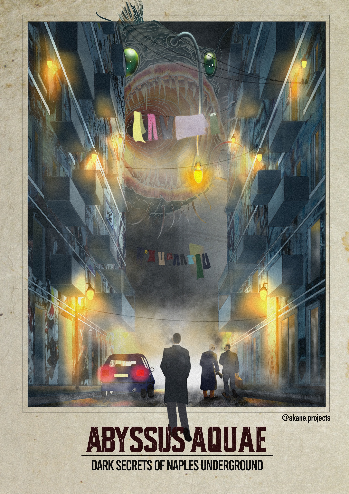
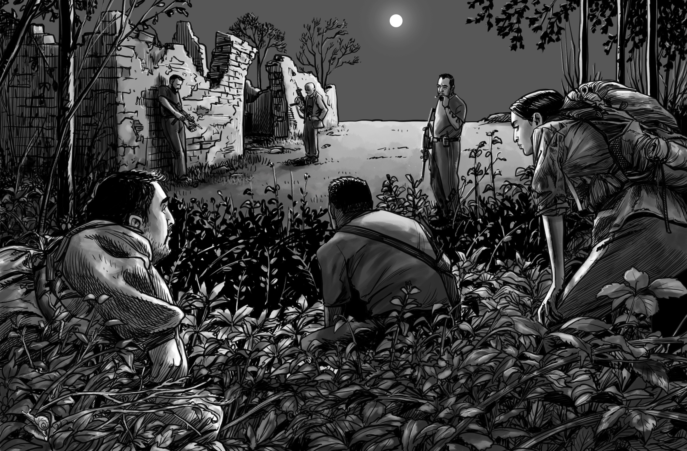
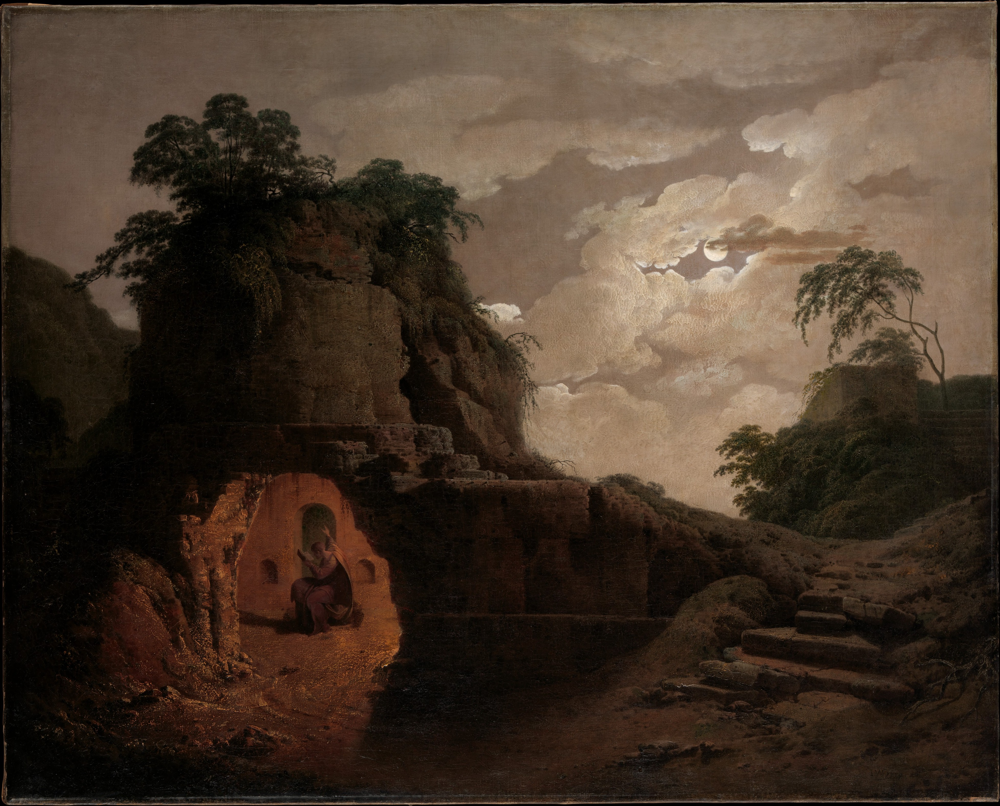

[Download scenario PDF](https://www.drivethrurpg.com/en/product/485837/abyssus-aquae){.btn .btn-outline-secondary .btn-sm}

---

{fig-align="center" width=100%}

## About this scenario

I dreamed one day of a deep well full of water where I had to plunge to discover a terrible secret. This dream sparked my imagination and inspired me to write this scenario for the Call of Cthulhu 7th edition role-playing game.

I had lots of fun designing, writing, researching, playtesting, and publishing this work. I learned many many things, and huge thanks to [The Storytelling Collective](https://www.storytelling-collective.com/) for providing guidance for this work.

The scenario is set in modern-day Naples, and intertwines elements of the ancient history of Naples with the modern reality of criminality. It is a high-stakes scenario that will challenge the players to survive until the end, and rescue a very close friend who unwillingly stepped into a horrible trap.

{fig-align="center" width=100%}

## Ancient history of Naples
Abyssus Aquae is set in Naples not for local colour but because Naples was already half a Call of Cthulhu scenario before Chaosium existed. The city sits on a dormant supervolcano. It is built on tuff quarried from beneath itself, leaving a second Naples hollowed into the rock — cisterns, aqueducts, catacombs, air-raid shelters, and tunnels nobody has a complete map of. And for most of its history, the person the Neapolitans considered responsible for keeping the lid on all of that was a poet who had been dead for a thousand years.

Virgil — Publius Vergilius Maro, author of the Aeneid, born 70 BC, died at Brindisi in 19 BC — lived long enough in Campania that he asked to be buried there, and was. His tomb, or the monument generally held to be his tomb, still stands at Piedigrotta, at the mouth of the Crypta Neapolitana, the long Roman road-tunnel that bores through the Posillipo hill. That is where the historical record ends and something stranger begins. Starting around the twelfth century, Neapolitans began telling stories in which Virgil was not only a poet but a sorcerer — the city's guardian magician, posthumously on duty. The legends spread from Naples across medieval Europe and, for a few centuries, Virgil the wizard was about as famous as Virgil the author of the Aeneid.

{fig-align="center" width=100%}

The tales are beautifully specific to place. Virgil is said to have conjured the Crypta Neapolitana itself in a single night, cutting the Posillipo in a feat of engineering so implausible by medieval standards that magic was the obvious explanation. He is said to have fashioned a bronze fly that drove every real fly from the city. And, most famously, he is said to have hidden an egg in the foundations of Castel dell'Ovo — the "Castle of the Egg," still standing on the islet of Megaride — whose integrity is bound to the fate of Naples. If the egg cracks, so does the city. In the fourteenth century, when part of the castle collapsed, Queen Giovanna I reportedly felt obliged to announce publicly that she had personally verified the egg's replacement, which tells you how seriously the story was still being taken.

There is a darker strand too, and this is the one Abyssus Aquae pulls on. In some versions of the legend, Virgil's magic came from a book — variously said to have been written by King Solomon, or by the centaur Chiron — which Virgil either authored, inherited, or discovered. When he was buried, his head was laid upon the book. In the Middle Ages an Englishman at the Norman court of Sicily — "Ludovicus," sometimes linked to Thomas Becket's circle — is supposed to have taken the book from the tomb to practice necromancy, and Virgil's bones were quietly moved to Castel dell'Ovo, where they were lost. The book was never recovered. This is the thread the scenario picks up: a lost tome, a modern archaeologist who thinks he knows where it went, and a very bad reason to want it back.

The Cimmerians are the other half of the equation. In Homer they are a mythic people who live "wrapped in mist and cloud" at the edge of the world, where the sun never shines. Later Greek and Roman geographers — Strabo especially — relocated them to the Phlegraean Fields just west of Naples, picturing them as a subterranean race living in tunnels around Lake Avernus, the volcanic lake the Romans considered an entrance to the underworld. Strabo goes further and suggests that the Roman architect Cocceius, who actually built the Crypta Neapolitana and the nearby Grotta di Cocceio, may have been inspired by older stories of Cimmerian tunnelling. There is no archaeological evidence that any Cimmerian people ever lived in Italy. But the idea that the ground under the Phlegraean Fields is honeycombed with something old and not-quite-human is older than Rome.

Walk the area today and the geology keeps agreeing with the myths. The Phlegraean Fields are still active — the ground at Pozzuoli rises and falls in slow-motion bradyseismic cycles, measured in decimeters per decade, and the Solfatara crater vents sulphur continuously. The Aqua Augusta, the 100-kilometre Roman aqueduct that ran from the Apennines to the great cistern at Misenum, is still partly walkable in places. Monte Gauro — the extinct cone where the scenario's climax unfolds — is a real crater with real ruins on it, including the remains of the Eremo del San Salvatore. Virgil's tomb is a real place you can visit for free. Castel dell'Ovo is open to the public most days.

What Abyssus Aquae does is take this stack — the sorcerer-poet, the lost book, the underground race, the protective spell, the ever-present volcano — and ask what happens when a modern academic starts pulling at threads he doesn't understand. Naples provided the scenery. I only had to cast it.