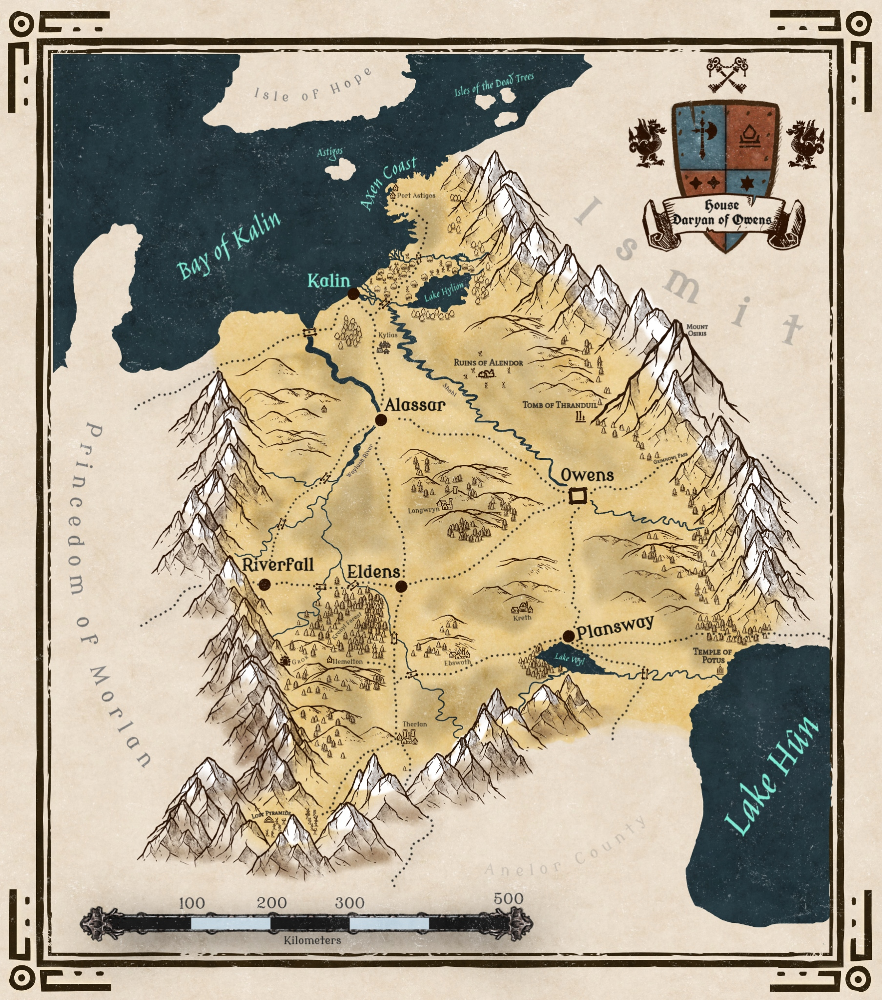

A small showcase of fantasy map making. All maps were drawn by me with [Inkarnate](https://www.inkarnate.com)

::: {.map-entry}
{fig-align="center" width=100%}

The world of Yara, my fantasy creation, is a small-ish continent surrounded by misterious impenetrable lands and oceans.
:::

::: {.map-entry}
{fig-align="center" width=100%}

The Princedom of Owens is one of the most fertile and rich parts of the Kingdom of Lorya.
:::

::: {.map-entry}
{fig-align="center" width=100%}

Kalin: pearl of the North. The city was built in ancient times around seven towers, and has never in history been conquered by force.
:::