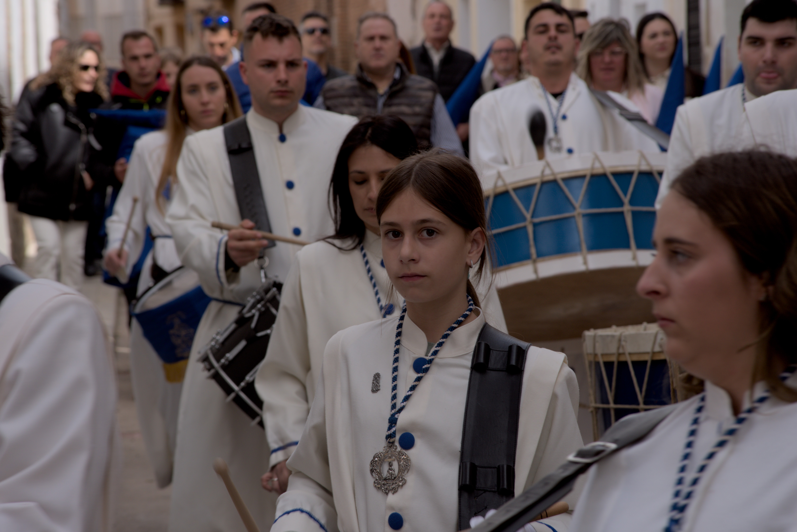

::: {.callout-note}
**Note** — These pictures were taken with a Nikon D750 digital camera.
:::

This gallery showcases some pictures I took in different times and different places. Enjoy!

::: {layout-ncol=1}
{#fig-easter .lightbox group="gallery"}

{#fig-mar-birth .lightbox group="gallery"}

{#fig-cocora .lightbox group="gallery"}
:::
<!--

{group="gallery"}
{group="gallery"}
{group="gallery"}
{group="gallery"}
:::
-->
