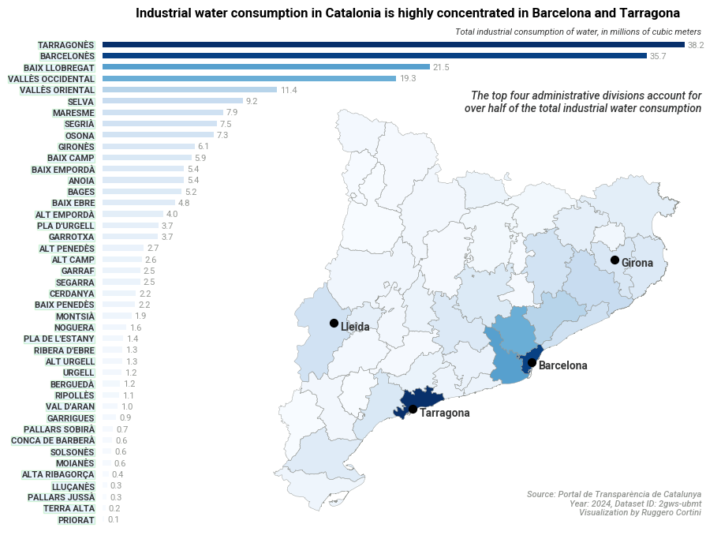

Catalonia publishes granular water consumption data — by sector and by *comarca* (the
administrative unit below province) — through the
[Portal de Transparència de Catalunya](https://analisi.transparenciacatalunya.cat).
Cross-referencing this with geographic boundaries from the
[Institut Cartogràfic i Geològic de Catalunya](https://www.icgc.cat) makes it possible to
map where industrial water use is actually concentrated.

## Result

The chart below pairs a ranked bar chart with an inset choropleth map. The colour scale is
shared across both panels, making it easy to spot the geographic clusters at a glance.

The concentration is stark: **the top four comarques account for over half of total
industrial water consumption**. Barcelonès and its neighbours dominate, with a secondary
cluster around Tarragona driven by the petrochemical complex at the mouth of the Ebre.

## Analysis

The notebook below walks through the full pipeline: fetching consumption data from the
Socrata API, loading comarca boundaries from a GeoJSON zip, merging the two datasets, and
producing the visualisation. [Download here](../assets/aigues_catalunya/0.ACA_APIs_exploration.ipynb).
