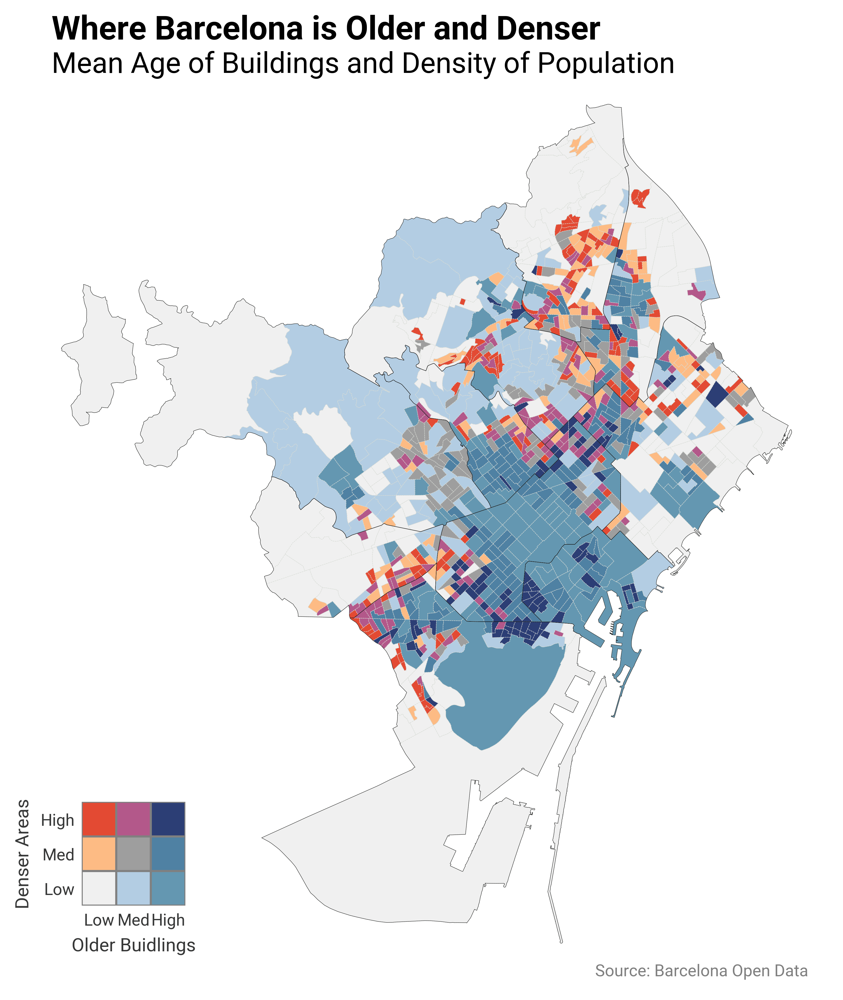

Barcelona's urban form carries its history in its buildings. The historic core is dense and
old; the outer ring is newer and more spread out — but how clearly does that pattern hold at
the census-section level? This project combines building-age data from the Cadastre with
population data from the municipal census, joining them onto the official geospatial
boundaries to produce a bivariate map.

Data sourced from the
[Ajuntament de Barcelona Open Data Portal](https://opendata-ajuntament.barcelona.cat/en/).

## Result

The bivariate colour scheme encodes two variables simultaneously: **building age** (x-axis of
the legend) and **population density** (y-axis). Dark blue-purple = old and dense; light
grey = new and sparse.

## Full analysis

The complete data pipeline — loading five geospatial datasets, merging them, computing
quantile-based bivariate classes, and producing all visualisations — is in the notebook
below. It can also be [downloaded here](../assets/barcelona_edificacions/map.ipynb).


