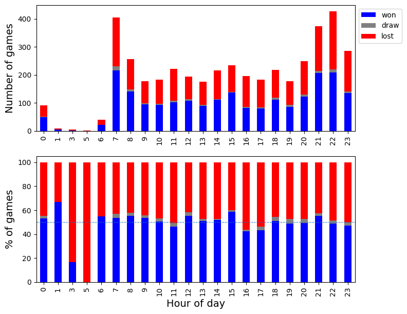
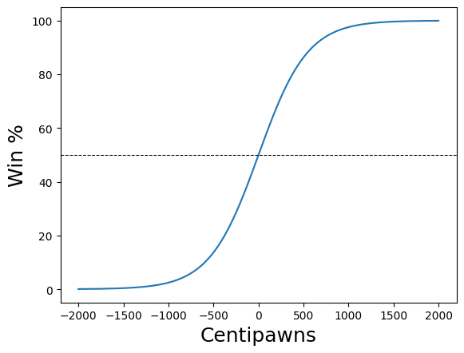
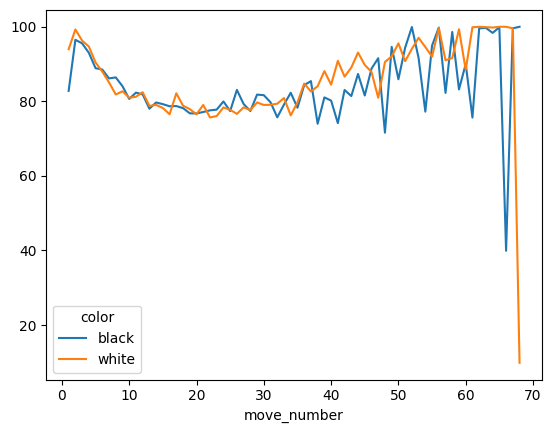
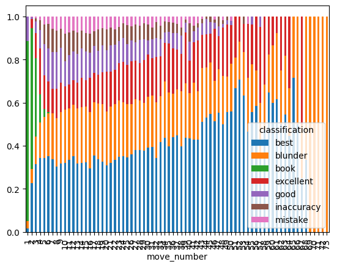

I play chess online — nothing serious, mostly blitz games — and I got curious whether I
could use data science tools to understand my patterns and weaknesses. This project builds
a full pipeline from raw API data to move-level engine analysis, using the same accuracy
formula that [Lichess](https://lichess.org) uses in their game reports.

Data is fetched from the public [chess.com API](https://www.chess.com/news/view/published-data-api)
(no authentication needed) and positions are evaluated with
[Stockfish 15.1](https://stockfishchess.org), the strongest open-source chess engine.

---

## When do I play best?

A first question: does the time of day affect my results? Fetching two years of games and
grouping by hour reveals a clear pattern.



The left panel shows raw game counts; the right shows percentages with a 50% reference
line. There is a visible dip in win rate in the late evening — not surprising for blitz,
where fatigue affects calculation speed.

---

## Move quality: the accuracy model

Chess.com and Lichess both publish move accuracy scores. The formula translates centipawn
evaluation into a win probability using a sigmoid, then measures how much that probability
dropped after each move:

$$
W(cp) = 50 + 50 \cdot \frac{2}{1 + e^{-0.00368208 \cdot cp}} - 1
$$

$$
\text{accuracy} = 103.1668 \cdot e^{-0.04354 \cdot \Delta W} - 3.1669
$$



The curve shows that small centipawn differences near equality (−100 to +100) produce
large changes in win probability — which is why a single blunder in a balanced position
can be so decisive.

Each move is then classified into one of seven categories based on centipawn loss:
**Book → Best → Excellent → Good → Inaccuracy → Mistake → Blunder**.

---

## Patterns across many games

Running this analysis across two months of games reveals where mistakes cluster.

**Accuracy by move number:**



Accuracy is highest in the opening (book moves) and peaks again in tactical middlegame
positions. It dips in the endgame — consistent with time pressure in blitz.

**Move classification by game phase:**



Blunders and mistakes concentrate in the 15–25 move range, where the position has
left familiar opening patterns but the endgame simplifications haven't yet reduced
the complexity. Inaccuracies are spread evenly throughout.

---

## Pipeline architecture

```
chess.com API  →  postprocess metadata  →  PGN extraction
                                                ↓
                                    Stockfish evaluation (per position)
                                                ↓
                                    Win% delta  →  move classification
                                                ↓
                                    Accuracy aggregation  →  plots
```

The batch analysis step (notebook 3) processes games in parallel using Python's
`ThreadPoolExecutor`. At depth 20 with 4 threads, a full game takes ~90 seconds;
5,000 games would take about 30 hours of engine time — feasible overnight on a
machine with a GPU-accelerated Stockfish build.

---

## Notebooks

| Notebook | What it covers |
|----------|---------------|
| [1 — Data retrieval](../assets/chess_analytics/1-retrieve_postprocess_data.ipynb) | chess.com API fetch, postprocessing, time-of-day analysis |
| [2 — Single game analysis](../assets/chess_analytics/2-single_game_analysis.ipynb) | move-by-move Stockfish evaluation, accuracy formula, game report |
| [4 — Move tables](../assets/chess_analytics/4-move_tables.ipynb) | batch classification, accuracy by move number, opening identification |
