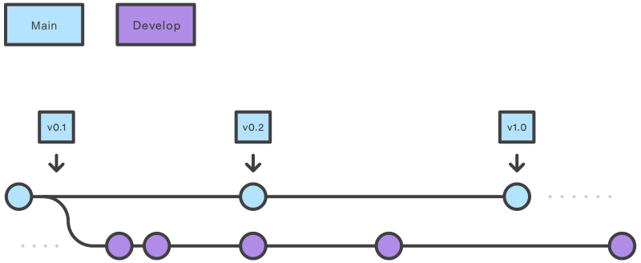
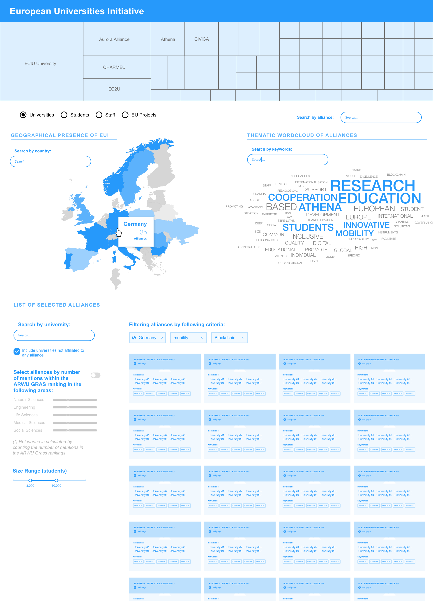
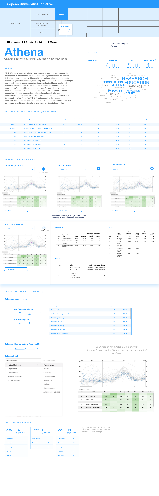

The [European University Alliances Observatory](https://eua-observatory.sirislab.com) is an
interactive analytics platform built by [SIRIS Academic](https://sirisacademic.com) that
tracks the research and education output of universities belonging to EU-funded alliances.
It covers 10+ alliances, ~100 member institutions across Europe, and draws on publication
records, EU funding data, staff demographics, and SDG alignment metrics.

The source code is private. This page describes the backend architecture I redesigned and
the data contract it produces.

---

## My role

I joined the project after an initial version of the backend had been built. My task was
to **redesign and simplify the pipeline architecture** using [Mage AI](https://www.mage.ai)
to make it more maintainable and correct, and to own the final JSON generation step that
feeds the React frontend.

---

## Architecture

The backend is a set of 10 Mage AI pipelines, each responsible for one data source or
processing stage. A master orchestration pipeline triggers them in sequence.

{fig-align="center" width=100%}

**Data sources integrated:**

| Source | What it provides |
|--------|-----------------|
| [OpenAlex](https://openalex.org) | Publication counts, research fields, keyword wordclouds (2012–2022) |
| [CORDIS](https://cordis.europa.eu) | EU project participation counts, via SPARQL endpoint |
| [ETER](https://www.eter-project.com) | Staff and student demographics per institution |
| [ARWU](https://www.shanghairanking.com) | Shanghai Rankings, resolved via Wikidata |
| [Wikidata](https://www.wikidata.org) | Entity disambiguation and cross-source ID mapping |
| [Google BigQuery](https://cloud.google.com/bigquery) | SDG specialization indices (EU27 baseline comparison) |

Each pipeline reads from or writes to a PostgreSQL database (schema: `eualliances`). Entity
disambiguation — matching the same institution across OpenAlex, CORDIS, ETER, ARWU, and
Wikidata — was the hardest part of the data model.

---

## Key contributions

**Member disambiguation pipeline** — The original logic for reconciling institution
identities across six databases was complex and fragile. I refactored it end-to-end,
reducing the block count by ~40% while making the matching more robust.

**Alliance pipeline foundation** — Moved database schema creation into the first pipeline
block, removing an external dependency that had caused environment setup issues.

**CORDIS and ETER pipelines** — Debugged and corrected EU project counting logic and staff
demographic extraction, both of which had silent data quality issues.

**SDG specialization pipeline** — Improved the topology of the BigQuery-based calculation
that compares each alliance's publication distribution against the EU27 baseline.

**JSON generation** — Fixed and owned the final pipeline block that merges all enriched
tables into the hierarchical JSON file consumed by the frontend.

---

## Output: the JSON artefact

The final pipeline produces a single JSON file — an array of alliance objects, each
containing aggregated metrics and a nested array of member institutions. The React frontend
loads this file once on startup and drives all views from it.

Simplified schema:

```json
[
  {
    "name": "4EU+",
    "display_name": "The 4EU+ Alliance",
    "website": "https://4euplus.eu",
    "coordinator": "Sorbonne University",
    "funded_year": "2019",
    "seal_of_excellence": true,
    "oa_alliance_npubs": 591055,
    "cordis_alliance_nprojects": 1487,
    "oa_wordcloud": "[{\"count\": 4200, \"key_display_name\": \"Clinical trial\"}, ...]",
    "sdg_si": { "3": 1.42, "7": 0.88, "13": 1.1 },
    "number_of_institutions": 7,
    "members": [
      {
        "institution_name": "Charles University",
        "wikidata_key": "Q182516",
        "oa_pubs_n": 54328,
        "oa_pubs_top_field_1": "Medicine",
        "cordis_projects_n": 612,
        "eter_staff_n": 8269,
        "eter_staff_women_pct": 48.2,
        "eter_students_n": 42224,
        "arwu_ranking": "301-400",
        "nuts_id": "CZ01"
      }
    ]
  }
]
```

---

## Result

The platform is live at
[eua-observatory.sirislab.com](https://eua-observatory.sirislab.com) and is used by SIRIS
Academic for research and policy analysis work on European higher education.




