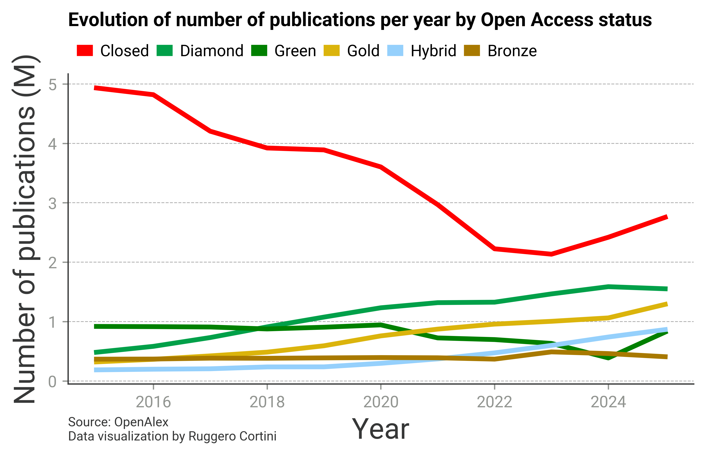

As an ex-researcher and ex-consultant in the field of Higher Education and Research, I have
been interested for a long time in publication practices. [OpenAlex](https://openalex.org)
provides a free, open API to query bibliographic data for millions of scholarly works. I used
it to track how the Open Access status of journal articles has evolved from 2015 to 2025.

## Result

The shift toward open access is striking: the share of paywalled (“closed”) articles has steadily declined, while Gold and Diamond open access have grown into major publication channels.

Gold open access in particular has become a dominant model among large publishers — improving public accessibility, but also shifting costs toward research funders through publication fees.

One thing I didn't fully understand was: in the last couple of years, closed publications appear to rise again. After an [interesting discussion on LinkedIn](https://www.linkedin.com/posts/ruggerocortini_ive-been-playing-with-open-data-from-openalex-activity-7428067595787882496-NkGV?utm_source=share&utm_medium=member_desktop&rcm=ACoAAAxIgjUB9Ap7PUl6pfHRNjDqjn66SaaATPE), the reason seems to be that the rise in closed publications is genuine, although it is complicated by the impact of embargos (meaning some of the 2025 closed publications will move to green if you re-run this analysis in future). James Butcher attributes most of the increase in closed publications to the growth in output from China, see: https://newsletter.journalology.com/p/the-rise-of-china-and-the-fall-of/. I know Cameron Neylon has also done some digging into this question and believes there is a wider slow down in the transition to OA, which matches my own impressions. Fundamentally, the growth in outputs is outstripping the funding available to pay for open access, and so much of the increase is being captured by closed outlets.

## Analysis

The full analysis — data retrieval from the OpenAlex API, processing, and visualisation —
is in the notebook that can be [downloaded here](../assets/OA_time.ipynb).
