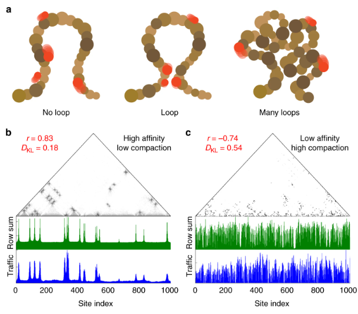

How does a transcription factor — a protein that needs to find and bind a specific short DNA
sequence among billions of base pairs — locate its target inside a cell nucleus? The
classical answer is 3D diffusion. But chromatin, the DNA–protein complex that packages the
genome, is not a simple solution: it folds into specific 3D structures that could either
help or hinder the search.

This project provides the simulation code for the paper:

> **Theoretical principles of transcription factor traffic on folded chromatin**
> R. Cortini & G. J. Filion
> *Nature Communications*, 2018
> [doi.org/10.1038/s41467-018-05765-0](https://doi.org/10.1038/s41467-018-05765-0)

---

## The model



Chromatin folding is described using the **Strings and Binders Switch (SBS)** model, in
which the polymer (DNA) folds into specific 3D conformations driven by bridging proteins.
On top of this folded structure we simulate **tracers** — diffusing particles that represent
transcription factors searching for their targets.

Four scenarios are modelled:

| Simulation type | What it tests |
|----------------|---------------|
| **Monovalent** | Single-binding-site tracers on folded chromatin |
| **Multivalent** | Multi-site tracers; basis for Figures 2–5 in the paper |
| **Crowding** | Effect of molecular crowding on tracer dynamics |
| **Varying diameter** | How tracer size affects search efficiency |

---

## Implementation

All simulations are written in Python and run on top of
[HOOMD-blue](https://hoomd-blue.readthedocs.io), a general-purpose particle simulation
toolkit developed at the University of Michigan. HOOMD-blue is optimised for GPU execution
via CUDA, making it possible to run the large numbers of independent simulation trajectories
needed to collect reliable statistics on stochastic search processes.

Trajectory analysis uses [MDAnalysis](https://www.mdanalysis.org), a widely-used
open-source library for processing molecular dynamics output.

**Full dependency stack — all free and open-source:**

| Tool | Role |
|------|------|
| [HOOMD-blue](https://hoomd-blue.readthedocs.io) v2.1+ | GPU-accelerated particle simulation engine |
| [MDAnalysis](https://www.mdanalysis.org) v0.17+ | Trajectory parsing and analysis |
| [GSD](https://gsd.readthedocs.io) | Compact binary format for topology and trajectories |
| NumPy · SciPy | Numerical processing |

---

## Reproducibility

The repository at [github.com/rcortini/sbs_tracers](https://github.com/rcortini/sbs_tracers)
contains all the code needed to reproduce every simulation figure in the paper. Each
simulation type maps directly to a specific figure or supplementary note, documented in the
README. Running a simulation requires only:

```bash
python sbs_tracers.py <options>
```

and analysis of the resulting `.gsd` trajectory file:

```bash
python script.py trajectory.gsd <options>
```

This was an early personal commitment to reproducible research: every number in the paper
comes from code that is publicly available, version-controlled, and runnable by anyone with
access to a GPU.
